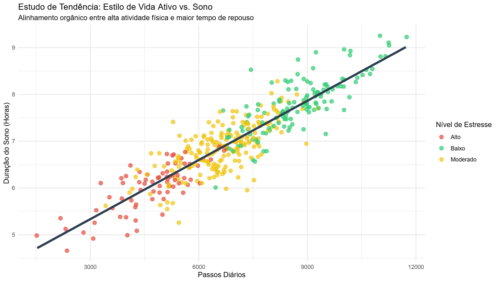

# Análise de Rotina: Atividade Física vs. Qualidade do Sono com R

Este projeto é uma análise exploratória de dados cotidianos (Self-Tracking). O objetivo foi avaliar o impacto do volume de atividade física diária (contagem de passos) na duração do sono da noite seguinte ao longo de uma semana de rotina.

O código foi executado sem a necessidade de ambiente local, rodando via **webR (R em WebAssembly)** diretamente no navegador.

---

## Visualização dos Dados

O gráfico abaixo cruza as três variáveis da análise: o volume de passos (altura das barras), a quantidade de horas de sono (escala de cores) e a meta estipulada (linha tracejada).

---

## Conceitos Aplicados no Código

* **Estruturação de Dados:** Consolidação de vetores em um `data.frame` organizado.
* **Transformação de Variáveis:** Conversão de tempo (Horas:Minutos) em frações decimais para viabilizar os cálculos matemáticos.
* **Manipulação de Fatores:** Uso da função `factor()` com ordenação explícita de níveis (`levels`), evitando que os dias da semana fossem organizados em ordem alfabética.
* **Estatística Descritiva:** Extração de médias (`mean`) e valores máximos (`max`).
* **Data Visualization:** Construção gráfica em camadas através do `ggplot2`, utilizando preenchimento gradiente (`scale_fill_gradient`), linha de referência horizontal (`geom_hline`) e texto de suporte (`annotate`).

---

## Insights Obtidos

* **Atingimento da Meta:** A meta de 6.000 passos diários foi superada em 3 dos 7 dias avaliados (Quarta, Quinta e Sábado).
* **Análise de Pico:** O Sábado registrou o maior volume de descanso (11,4 horas de sono). A variação indica uma compensação após o dia mais ativo da semana (Quarta-feira, com 7.035 passos) combinada com a flexibilidade do fim de semana.
* **Consistência Geral:** A média geral fechou em 5.793 passos/dia, alinhada com o objetivo inicial traçado.

---

## Como Executar

1. Acesse o console interativo em [webR REPL](https://webr.sh).
2. Copie o código do arquivo `script.R` deste repositório.
3. Cole no terminal do site e pressione `Enter`.
